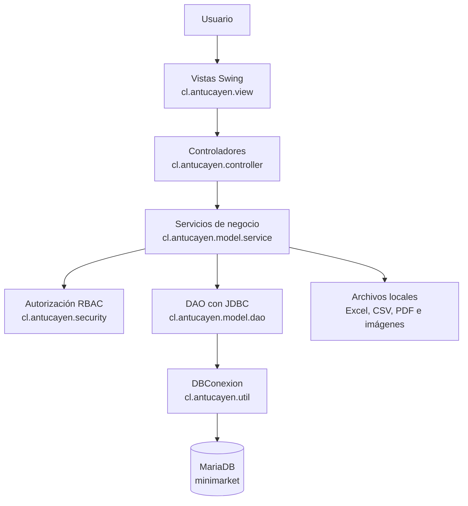
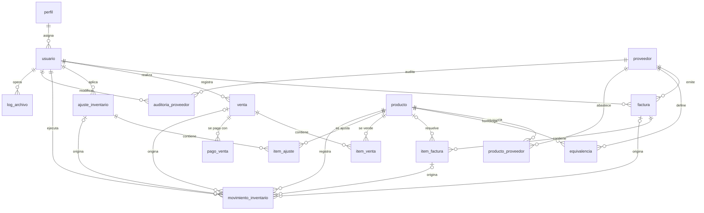

# Minimarket Antucayen — Sistema de Gestión


Aplicación de escritorio **Java/Swing** para la gestión del minimarket Antucayen: productos y stock, proveedores, facturas de compra, punto de venta, historial de movimientos, reportes y usuarios con control de acceso por roles, sobre una base de datos **MariaDB**.

## Tabla de contenidos

1. [Descripción](#descripción)
2. [Objetivo](#objetivo)
3. [Funcionalidades](#funcionalidades)
4. [Tecnologías](#tecnologías)
5. [Arquitectura](#arquitectura)
6. [Estructura del proyecto](#estructura-del-proyecto)
7. [Requisitos](#requisitos)
8. [Instalación](#instalación)
9. [Configuración](#configuración)
10. [Base de datos](#base-de-datos)
11. [Ejecución](#ejecución)
12. [Uso](#uso)
13. [API y endpoints](#api-y-endpoints)
14. [Roles y permisos](#roles-y-permisos)
15. [Pruebas](#pruebas)
16. [Despliegue](#despliegue)
17. [Estado actual](#estado-actual)
18. [Solución de problemas](#solución-de-problemas)
19. [Licencia](#licencia)

## Descripción

**Minimarket Antucayen** es un sistema de gestión de escritorio que cubre la operación diaria de un minimarket desde una única aplicación:

- Catálogo de productos y control de stock.
- Proveedores y equivalencias entre los códigos de cada proveedor y los SKU internos.
- Registro y procesamiento de facturas de compra, con ingreso manual o extracción de ítems desde PDF e imágenes (texto embebido u OCR).
- Ajustes masivos de inventario desde archivos Excel o CSV, con validación y previsualización.
- Punto de venta con pago en efectivo, débito, crédito o combinado, cálculo de vuelto y comprobante imprimible.
- Historial de movimientos de inventario, reportes y exportaciones a CSV y Excel.
- Administración de usuarios con tres roles: Administrador, Bodeguero y Cajero.

| Dato | Valor |
|---|---|
| Tipo de aplicación | Escritorio (Java Swing) |
| Artefacto Maven | `cl.antucayen:Antucayen:1.0-SNAPSHOT` |
| Clase principal | `cl.antucayen.Main` |
| Base de datos | MariaDB, base `minimarket` |
| Versión de esquema requerida | `20260929` |

## Objetivo

Mantener un inventario confiable y trazable para el minimarket. Cada compra, venta, ajuste o reversión modifica el stock mediante operaciones transaccionales que registran un movimiento de inventario asociado al usuario que las ejecuta. Sobre esa base, el sistema ofrece la operación de caja, la homologación de códigos de proveedores, la generación de reportes y un control de acceso por roles que se aplica tanto en la interfaz como en la capa de servicios.

## Funcionalidades

### Autenticación y sesión

- Inicio de sesión con usuario y contraseña. Solo ingresan usuarios activos cuyo perfil sea uno de los tres roles soportados.
- Contraseñas almacenadas con PBKDF2-HMAC-SHA256 (210.000 iteraciones y sal aleatoria de 16 bytes). Los hashes SHA-256 heredados se aceptan y se migran automáticamente a PBKDF2 tras un inicio de sesión correcto.
- Verificación del esquema de la base de datos antes de autenticar: versión, tablas, columnas y catálogo de perfiles.
- Pantalla inicial según el rol: Dashboard (Administrador), Productos (Bodeguero) o Punto de Venta (Cajero).
- Cierre de sesión con confirmación.

### Dashboard

Disponible para el Administrador. Muestra las ventas de hoy (total y desglose por Efectivo, Débito y Crédito), las ventas del mes, los productos activos, las facturas pendientes, los movimientos del día, la cantidad de productos activos con stock bajo (10 unidades o menos) y el top 5 de productos más vendidos del mes.

### Punto de Venta

Disponible para Administrador y Cajero.

- Búsqueda o escaneo por SKU, código de barras o nombre. Solo se pueden vender productos activos y con stock.
- Carrito con cantidades editables y validación de stock disponible.
- Pago único (Efectivo, Débito o Crédito) o dividido entre varios medios, con cálculo en vivo de lo que falta o del vuelto. El vuelto solo puede provenir del efectivo recibido.
- Confirmación atómica de la venta: bloquea los productos, revalida stock, estado y precio, aplica el precio vigente del producto, descuenta el stock y registra movimientos de tipo `Venta`.
- Comprobante de venta automático, visualizable e imprimible.
- Listado de ventas del día (el Cajero ve solo las suyas) y anulación de ventas pagadas con devolución de stock, reservada al Administrador.

### Productos y stock

Consulta para los tres roles; gestión para Administrador y Bodeguero.

- Búsqueda por nombre, SKU o código de barras.
- Alta, edición e inactivación lógica de productos. El SKU y el código de barras son únicos y cada producto puede asociarse a uno o más proveedores.
- El stock no se edita desde la ficha del producto: solo cambia mediante compras, ventas, ajustes y reversiones.
- Consulta del stock actual y de los últimos 10 movimientos de un producto.

### Proveedores y equivalencias

Disponible para Administrador y Bodeguero.

- Alta y edición de proveedores (RUT opcional; nombre, teléfono y correo electrónico obligatorios). Cada campo modificado queda registrado en `auditoria_proveedor`.
- Equivalencias entre el código interno del proveedor y el SKU del sistema: las registran Administrador y Bodeguero; solo el Administrador puede modificarlas o eliminarlas.
- Consulta de equivalencias con filtros combinables por proveedor, código interno y SKU.

### Facturas de compra

Disponible para Administrador y Bodeguero.

- Registro con ingreso manual de ítems o desde un archivo digital (PDF, JPG, JPEG o PNG, máximo 10 MB), con vista previa y extracción de ítems. En los PDF se intenta primero el texto embebido y, si no se obtienen ítems, se aplica OCR página por página.
- Control de duplicados por proveedor y número de factura.
- Resolución automática del SKU de cada ítem mediante las equivalencias del proveedor. Cada ítem queda `Válido`, `Observado` o `No Procesado`, y la factura `Pendiente`, `Observada` o `Procesada`.
- Procesamiento: ingresa al stock los ítems válidos, una sola vez por ítem, y permite reprocesar la factura después de corregir sus equivalencias. La corrección manual de la equivalencia de un ítem observado está reservada al Administrador.
- El reproceso de una factura ya `Procesada` requiere autorización explícita del Administrador y revierte los ingresos anteriores antes de reaplicarlos.
- Consulta con filtros por número, proveedor, rango de fechas y estado, y apertura del archivo adjunto.

### Importación y ajuste masivo de inventario

Disponible para Administrador y Bodeguero.

- Carga de archivos `.xlsx`, `.xls` o `.csv` (máximo 10 MB) cuya primera fila contenga las columnas `SKU` y `cantidad`. En CSV se acepta `,` o `;` como separador.
- Dos modalidades, sin valor por defecto: `Sumar al stock actual` o `Reemplazar stock actual`.
- Previsualización con el stock proyectado, reporte de errores por fila y resolución de SKU duplicados (consolidar o rechazar cada grupo).
- Las cantidades negativas solo se admiten con la opción «Corrección autorizada», exclusiva del Administrador.
- Aplicación atómica del ajuste y posterior reversión completa del ajuste, reservada al Administrador.

### Historial y reportes

Disponibles para los tres roles.

- Historial de movimientos con filtros por SKU, tipo de movimiento y rango de fechas.
- Reportes de stock actual, equivalencias faltantes, facturas (por estado y fechas) y movimientos (por rango de fechas).

### Exportaciones

| Exportación | Pantalla y acción | Formatos |
|---|---|---|
| Inventario (productos activos) | Productos → «Exportar CSV/Excel» | CSV, XLSX |
| Historial de movimientos | Historial → «Exportar CSV/Excel» | CSV, XLSX |
| Ítems válidos de una factura | Procesamiento de Factura → «Exportar válidos» | CSV, XLSX |
| Reporte generado en pantalla | Reportes → «Exportar Excel» | XLSX |
| Plantilla de importación | Importar inventario → «Descargar plantilla» | CSV, XLSX |

Los CSV se generan en UTF-8 con BOM y separados por comas. Cada importación, exportación y plantilla queda registrada en la tabla `log_archivo`.

### Usuarios y personalización

- Creación, edición (nombre completo, nombre de usuario y perfil) y desactivación de usuarios, reservadas al Administrador.
- Cinco temas visuales: Azul Corporativo, Verde Esmeralda, Púrpura Elegante, Naranja Cálido y Oscuro Nocturno. Se eligen en la pantalla de inicio de sesión o con «Cambiar tema» en el menú lateral.

## Tecnologías

| Componente | Tecnología | Versión | Uso en el proyecto |
|---|---|---|---|
| Lenguaje | Java | 21 (`maven.compiler.release`) | Código de la aplicación |
| Interfaz | Swing + FlatLaf | FlatLaf 3.5.4 | Ventanas, formularios y tema `FlatLightLaf` |
| Base de datos | MariaDB | — | Persistencia |
| Conector JDBC | `mariadb-java-client` | 3.3.3 | Conexión a MariaDB |
| Excel | Apache POI (`poi-ooxml`) | 5.2.5 | Lectura de `.xlsx`/`.xls` y generación de `.xlsx` |
| CSV | OpenCSV | 5.9 | Lectura de archivos CSV |
| PDF | Apache PDFBox | 3.0.3 | Texto embebido y renderizado de páginas |
| OCR | Tess4J | 5.13.0 | Reconocimiento de texto en facturas escaneadas |
| Pruebas | JUnit Jupiter | 5.10.2 | Pruebas unitarias |
| Build | Apache Maven | — | `maven-compiler-plugin` 3.13.0, `maven-surefire-plugin` 3.2.5, `maven-shade-plugin` 3.5.3 |

## Arquitectura

La aplicación sigue una arquitectura en capas (MVC con capa de servicios y DAO):



| Capa | Paquete | Responsabilidad |
|---|---|---|
| Vista | `cl.antucayen.view` | Pantallas y diálogos Swing. No acceden a los DAO. |
| Controlador | `cl.antucayen.controller` | Conectan los eventos de las vistas con los servicios y muestran los resultados. |
| Servicio | `cl.antucayen.model.service` | Reglas de negocio, validaciones, autorización y transacciones. |
| Acceso a datos | `cl.antucayen.model.dao` | SQL sobre MariaDB mediante `PreparedStatement`. |
| Modelo | `cl.antucayen.model.entity`, `cl.antucayen.model.dto` | Entidades y proyecciones de lectura. |
| Seguridad | `cl.antucayen.security` | Roles (`RolSistema`), autorización (`Autorizacion`) y hash de contraseñas (`PasswordHasher`). |
| Utilidades | `cl.antucayen.util` | Conexión (`DBConexion`), sesión (`SesionActual`), verificación de esquema (`VerificadorEsquema`) y temas (`GestorTemas`, `Tema`). |

Decisiones de diseño relevantes:

- **Autorización en los servicios.** `Autorizacion` centraliza los permisos y se invoca desde los servicios de negocio, de modo que la seguridad no depende de ocultar botones u opciones del menú.
- **Sesión en memoria.** `SesionActual` mantiene el usuario autenticado durante la ejecución de la aplicación.
- **Conexión única y transacciones.** `DBConexion` es un singleton con una conexión JDBC compartida. Las operaciones que afectan a varias tablas se ejecutan con `ejecutarEnTransaccion(...)`, que confirma o revierte el conjunto y se integra en una transacción ya abierta.
- **Bloqueo de filas.** Las operaciones sobre stock, ventas, facturas y ajustes leen con `SELECT ... FOR UPDATE` antes de modificar.
- **Contrato de esquema.** `VerificadorEsquema` comprueba al iniciar sesión que la base de datos corresponde a la versión `20260929`.
- **Valores enteros.** Precios, montos y cantidades se almacenan como `INT`.

## Estructura del proyecto

```text
.
├── database/
│   └── Antucayen_Instalacion_Unica.sql    # Esquema completo y datos de demostración
├── src/
│   ├── main/
│   │   ├── java/cl/antucayen/
│   │   │   ├── Main.java                  # Punto de entrada
│   │   │   ├── controller/                # 12 controladores
│   │   │   ├── model/
│   │   │   │   ├── dao/                   # 15 DAO (JDBC)
│   │   │   │   ├── dto/                   # ProductoVendido, ReporteTabular
│   │   │   │   ├── entity/                # 17 entidades
│   │   │   │   ├── exception/             # EquivalenciaDuplicadaException
│   │   │   │   └── service/               # 17 servicios de negocio
│   │   │   ├── security/                  # Autorizacion, PasswordHasher, RolSistema
│   │   │   ├── util/                      # DBConexion, SesionActual, VerificadorEsquema, GestorTemas, Tema
│   │   │   └── view/                      # 20 vistas Swing
│   │   │       └── components/            # ComponentesSwing, SelectorFecha
│   │   └── resources/
│   │       └── config.properties.example  # Plantilla de configuración de la conexión
│   └── test/java/cl/antucayen/            # 6 clases de prueba (JUnit 5)
├── .idea/                                 # Configuración de IntelliJ IDEA
├── .gitattributes
├── .gitignore
├── pom.xml
└── README.md
```

### Mapa de módulos

| Módulo | Vistas | Controlador | Servicios principales |
|---|---|---|---|
| Inicio de sesión | `VLogin` | `ControladorLogin` | `ServicioAutenticacion` |
| Ventana principal | `VPrincipal` | `ControladorPrincipal` | — |
| Dashboard | `VDashboard` | `ControladorDashboard` | `ServicioDashboard` |
| Punto de Venta | `VVentas`, `VComprobanteVenta` | `ControladorVenta` | `ServicioVenta`, `ServicioComprobanteVenta`, `ServicioProducto` |
| Productos | `VBuscadorProductos`, `VFormularioProducto`, `VHistorialProducto` | `ControladorProducto` | `ServicioProducto`, `ServicioInventario`, `ServicioExportacionDatos` |
| Proveedores y equivalencias | `VBuscadorProveedores`, `VFormularioProveedor`, `VConsultaEquivalencias` | `ControladorProveedor` | `ServicioProveedor`, `ServicioEquivalencia` |
| Facturas | `VFacturas`, `VFormularioFactura`, `VDetalleFactura` | `ControladorFactura` | `ServicioFactura`, `ServicioArchivoFactura`, `ServicioExtraccionFacturaDigital` |
| Procesamiento de factura | `VProcesamientoFactura`, `VReporteErrores` | `ControladorProcesamientoFactura` | `ServicioProcesamientoFactura`, `ServicioExportacionDatos` |
| Importación de inventario | `VAjusteInventario`, `VReporteErrores` | `ControladorAjusteInventario` | `ServicioImportacionInventario`, `ServicioInventario`, `ServicioAuditoriaArchivos` |
| Historial | `VHistorial` | `ControladorHistorial` | `ServicioInventario`, `ServicioExportacionDatos` |
| Reportes | `VReportes` | `ControladorReportes` | `ServicioReportes`, `ServicioExportacionDatos` |
| Usuarios | `VGestionUsuarios` | `ControladorUsuario` | `ServicioUsuario` |

## Requisitos

| Requisito | Detalle |
|---|---|
| JDK | 21 o superior. El `pom.xml` compila con `maven.compiler.release=21`; la configuración de IntelliJ incluida en `.idea/misc.xml` apunta a un JDK 25. |
| Apache Maven | 3.9 o superior (recomendado). El repositorio no incluye Maven Wrapper. |
| MariaDB | Servidor 10.6 o superior (recomendado). |
| Cliente `mariadb` | Para ejecutar el script de instalación de la base de datos. |
| Tesseract OCR | Opcional. Solo es necesario, junto con sus datos de idioma (`tessdata`), para extraer ítems de imágenes o PDF escaneados. |
| Entorno gráfico | La aplicación abre ventanas Swing. |

## Instalación

1. **Clona el repositorio** y entra en su carpeta.

```bash
   git clone <URL_DEL_REPOSITORIO>
   cd <CARPETA_DEL_REPOSITORIO>
```

2. **Crea la base de datos** ejecutando el script de instalación (ver [Base de datos](#base-de-datos)).

```bash
   mariadb -u root -p < database/Antucayen_Instalacion_Unica.sql
```

3. **Prepara una cuenta de MariaDB para la aplicación.** El script no crea usuarios ni otorga permisos, y el repositorio no incluye otro script para hacerlo. La aplicación ejecuta sentencias `SELECT`, `INSERT`, `UPDATE` y `DELETE` sobre la base `minimarket` y consulta `information_schema` para validar el esquema, por lo que la cuenta debe tener esos permisos. El archivo de ejemplo usa el nombre `antucayen_app`.

4. **Configura la conexión** con `config.properties` o con variables de entorno (ver [Configuración](#configuración)).

5. **Compila y empaqueta.** Este comando también ejecuta las pruebas.

```bash
   mvn clean package
```

6. **Ejecuta la aplicación** (ver [Ejecución](#ejecución)).

```bash
   java -jar target/Antucayen-1.0-SNAPSHOT.jar
```

## Configuración

### Conexión a la base de datos

La conexión se puede definir de dos formas. Si una variable de entorno tiene valor, tiene prioridad sobre la propiedad equivalente del archivo.

**Opción A: archivo `config.properties`.** Copia la plantilla en la misma carpeta y completa las credenciales:

```bash
cp src/main/resources/config.properties.example src/main/resources/config.properties
```

```cmd
copy src\main\resources\config.properties.example src\main\resources\config.properties
```

```properties
db.host=127.0.0.1
db.port=3306
db.nombre=minimarket
db.usuario=antucayen_app
db.contrasena=CAMBIAR_ESTA_CONTRASENA
# true solo si tu servidor MariaDB está configurado para SSL/TLS.
db.ssl=false
```

`config.properties` está excluido de Git en `.gitignore`. La aplicación lo lee desde el classpath, por lo que debe existir **antes** de compilar para quedar incluido en el JAR.

**Opción B: variables de entorno.** Permiten ejecutar el JAR sin empaquetar credenciales:

```bash
export ANTUCAYEN_DB_HOST=127.0.0.1
export ANTUCAYEN_DB_PORT=3306
export ANTUCAYEN_DB_NAME=minimarket
export ANTUCAYEN_DB_USER=antucayen_app
export ANTUCAYEN_DB_PASSWORD='CAMBIAR_ESTA_CONTRASENA'
```

| Propiedad | Variable de entorno | Obligatoria | Descripción |
|---|---|---|---|
| `db.host` | `ANTUCAYEN_DB_HOST` | Sí | Host del servidor MariaDB |
| `db.port` | `ANTUCAYEN_DB_PORT` | Sí | Puerto del servidor |
| `db.nombre` | `ANTUCAYEN_DB_NAME` | Sí | Nombre de la base de datos |
| `db.usuario` | `ANTUCAYEN_DB_USER` | Sí | Usuario de MariaDB |
| `db.contrasena` | `ANTUCAYEN_DB_PASSWORD` | Sí | Contraseña; no puede quedar vacía |
| `db.ssl` | `ANTUCAYEN_DB_SSL` | No | `true` para usar SSL/TLS; por defecto `false` |

Con estos valores la aplicación construye la URL `jdbc:mariadb://<host>:<port>/<nombre>` con los parámetros `useUnicode=true`, `characterEncoding=UTF-8`, `allowPublicKeyRetrieval=true` y `useSsl`.

### OCR de facturas

| Variable de entorno | Obligatoria | Descripción |
|---|---|---|
| `ANTUCAYEN_TESSDATA` | No | Ruta de la carpeta de datos de Tesseract (`tessdata`). Solo se aplica si está definida. |
| `ANTUCAYEN_OCR_LANG` | No | Idioma que se entrega a Tesseract. Por defecto `eng`. |

### Archivos que genera la aplicación

| Ruta | Contenido |
|---|---|
| `archivos/facturas/` | Copia de cada archivo digital adjunto a una factura. La carpeta se crea en el directorio desde el que se ejecuta la aplicación y la ruta absoluta se guarda en la base de datos. |
| `~/.antucayen/tema.properties` | Tema visual elegido, guardado en la carpeta personal del usuario del sistema operativo. |

## Base de datos

### Instalación del esquema

El archivo `database/Antucayen_Instalacion_Unica.sql` es la única fuente del esquema. Crea la base `minimarket` (`utf8mb4`, colación `utf8mb4_spanish_ci`, tablas InnoDB) y carga datos de demostración. El repositorio no incluye migraciones incrementales.

> [!WARNING]
> El script ejecuta `DROP DATABASE IF EXISTS minimarket` y vuelve a crear la base. Si ya tienes datos, respáldalos antes de ejecutarlo.

```bash
# Linux / macOS
mariadb -u root -p < database/Antucayen_Instalacion_Unica.sql
```

```cmd
:: CMD de Windows
mariadb -u root -p < database\Antucayen_Instalacion_Unica.sql
```

```powershell
# PowerShell
Get-Content .\database\Antucayen_Instalacion_Unica.sql | mariadb -u root -p
```

El script está codificado en UTF-8 y sus restricciones contienen valores con tilde (`Válido`, `Débito`, `Crédito`, `Reversión`), por lo que debe ejecutarse conservando esa codificación.

### Modelo de datos



| Tabla | Contenido |
|---|---|
| `perfil` | Catálogo de roles: `Administrador`, `Bodeguero` y `Cajero`. |
| `usuario` | Usuarios, hash de contraseña, estado activo y perfil. |
| `producto` | SKU (clave primaria), nombre, código de barras único, unidad de medida, precio de venta, stock actual y estado. |
| `proveedor` | RUT opcional y único, nombre único, teléfono y correo electrónico. |
| `producto_proveedor` | Relación muchos a muchos entre productos y proveedores. |
| `equivalencia` | Código interno del proveedor asociado a un SKU; la clave es proveedor + código. |
| `auditoria_proveedor` | Cambios por campo en los proveedores: valor anterior, valor nuevo, usuario y fecha. |
| `factura` | Facturas de compra: número, fecha de emisión, estado, valor total y ruta del archivo digital. Única por proveedor y número. |
| `item_factura` | Ítems de factura: código del proveedor, descripción, SKU resuelto, cantidad, precio unitario de compra y estado. |
| `venta` | Ventas: fecha y hora, usuario, medio de pago, monto total y estado. |
| `item_venta` | Ítems de venta: SKU, cantidad, precio unitario y subtotal. |
| `pago_venta` | Pagos aplicados a cada venta por medio de pago; permite pagos divididos. |
| `ajuste_inventario` | Cabecera de cada ajuste masivo: modalidad, estado y usuario. |
| `item_ajuste` | Detalle del ajuste: cantidad aplicada, stock anterior y stock resultante. |
| `movimiento_inventario` | Historial de movimientos de stock, con referencia opcional a factura, ítem de factura, venta o ajuste y marca `vigente`. |
| `log_archivo` | Bitácora de importaciones, exportaciones y plantillas generadas. |
| `app_schema_version` | Versión del esquema instalada. |

### Valores controlados por el esquema

| Tabla y columna | Valores permitidos |
|---|---|
| `producto.estado` | `Activo`, `Inactivo` |
| `factura.estado` | `Pendiente`, `Procesada`, `Observada` |
| `item_factura.estado_item` | `Válido`, `Observado`, `No Procesado` |
| `venta.estado` | `En curso`, `Pagada`, `Anulada` |
| `venta.medio_pago` | `Pendiente`, `Efectivo`, `Débito`, `Crédito`, `Mixto` |
| `pago_venta.medio_pago` | `Efectivo`, `Débito`, `Crédito` |
| `ajuste_inventario.modalidad_ajuste` | `Sumar al stock actual`, `Reemplazar stock actual` |
| `ajuste_inventario.estado_ajuste` | `Pendiente`, `Aplicado`, `Revertido` |
| `movimiento_inventario.tipo_movimiento` | `Ingreso por compra`, `Venta`, `Ajuste positivo`, `Ajuste negativo`, `Reversión` |
| `log_archivo.tipo_operacion` | `IMPORTACION`, `EXPORTACION`, `PLANTILLA` |
| `log_archivo.resultado` | `EXITOSO`, `ERROR` |

El esquema también impide precios, montos y stock negativos mediante restricciones `CHECK`.

### Datos de demostración

La instalación carga los 3 perfiles, 3 usuarios (ver [Uso](#uso)), 6 productos, 2 proveedores, 3 asociaciones producto–proveedor, 2 equivalencias y el registro de versión `20260929` en `app_schema_version`.

### Verificación del esquema

Antes de autenticar, `VerificadorEsquema` comprueba que:

- exista la tabla `app_schema_version` y su versión máxima sea `20260929` o superior;
- existan las 16 tablas de negocio con las columnas que la aplicación utiliza;
- la tabla `perfil` contenga exactamente los tres perfiles soportados.

Si alguna comprobación falla, el inicio de sesión se rechaza con un mensaje que indica la diferencia detectada.

## Ejecución

Desde la raíz del proyecto, con la base de datos instalada y la conexión configurada:

```bash
mvn clean package
java -jar target/Antucayen-1.0-SNAPSHOT.jar
```

`maven-shade-plugin` genera un JAR ejecutable con todas las dependencias y con `cl.antucayen.Main` como clase principal. Como alternativa, se puede ejecutar esa clase directamente desde el IDE.

Ten en cuenta que:

- Si creas o modificas `config.properties` después de empaquetar, debes volver a ejecutar `mvn clean package` o usar las variables de entorno.
- Los archivos adjuntos de las facturas se guardan en `archivos/facturas/` dentro del directorio de trabajo. Ejecuta siempre la aplicación desde la misma carpeta para que las rutas registradas sigan siendo válidas.

## Uso

### Usuarios de demostración

Tras una instalación nueva de la base de datos están disponibles estas cuentas:

| Usuario | Contraseña | Perfil | Pantalla inicial |
|---|---|---|---|
| `guido_admin` | `admin123` | Administrador | Dashboard |
| `matias_bodega` | `bodega123` | Bodeguero | Productos |
| `cajero_demo` | `cajero123` | Cajero | Punto de Venta |

> [!IMPORTANT]
> Son credenciales de demostración. Para un uso real, crea tus propios usuarios en «Usuarios y permisos» y desactiva estas cuentas: la aplicación no incluye una función para cambiar contraseñas.

### Menú lateral

| Sección | Opción | Función | Roles |
|---|---|---|---|
| PRINCIPAL | Dashboard | Indicadores de ventas, stock y facturas | Administrador |
| PRINCIPAL | Punto de Venta | Venta, cobro y ventas del día | Administrador, Cajero |
| INVENTARIO | Productos | Catálogo, stock y exportación | Todos |
| INVENTARIO | Proveedores | Proveedores y sus equivalencias | Administrador, Bodeguero |
| INVENTARIO | Equivalencias | Consulta de equivalencias | Administrador, Bodeguero |
| FACTURACIÓN | Facturas | Listado, detalle y procesamiento | Administrador, Bodeguero |
| FACTURACIÓN | Procesar factura | Acceso directo al registro de una factura | Administrador, Bodeguero |
| INVENTARIO MASIVO | Importar inventario | Ajuste masivo desde Excel o CSV | Administrador, Bodeguero |
| ANÁLISIS | Historial | Movimientos de inventario | Todos |
| ANÁLISIS | Reportes | Reportes y exportación a Excel | Todos |
| ADMINISTRACIÓN | Usuarios y permisos | Gestión de usuarios | Administrador |

En la parte inferior del menú están «Cambiar tema» y «Cerrar sesión».

### Registrar una venta

1. Abre **Punto de Venta**. El sistema inicia automáticamente una venta «En curso».
2. Escribe o escanea el SKU, el código de barras o el nombre del producto y presiona Enter o «+ Agregar». La cantidad se edita en la columna «Cantidad» del carrito.
3. Indica el pago con los botones de pago único (Efectivo, Débito, Crédito) o escribiendo el monto de cada medio para dividirlo. La pantalla muestra cuánto falta o el vuelto.
4. Presiona «Cobrar» y confirma. Se muestra el comprobante, que puede imprimirse, y se abre una nueva venta.

El Administrador puede anular una venta haciendo doble clic sobre una venta «Pagada» en la lista «Ventas de hoy»; el stock de sus ítems se devuelve.

### Registrar y procesar una factura de compra

1. Verifica que el proveedor exista y que tenga registradas las equivalencias de sus códigos: **Proveedores** → doble clic sobre el proveedor → «Equivalencias de códigos».
2. Abre **Facturas** → «+ Nueva factura» (o **Procesar factura** en el menú) y completa proveedor, N° de factura, valor total, fecha de emisión y modalidad:
   - **Ingreso manual:** agrega cada ítem con «+ Agregar ítem» e indica código del proveedor, descripción y cantidad.
   - **Archivo digital (PDF/JPG/PNG):** elige el archivo con «Seleccionar», revísalo con «Vista previa» y usa «Extraer ítems». Las líneas que no se pueden leer quedan como `No Procesado` y la grilla se puede corregir a mano.
3. Presiona «Guardar factura». El sistema resuelve los SKU con las equivalencias y muestra un resumen. En este paso no se modifica el stock.
4. En el listado, haz doble clic sobre la factura y elige «Procesar Ítems». Al abrir esa ventana se ingresan al stock los ítems válidos; la factura queda `Procesada` si todos lo son, u `Observada` si quedan ítems pendientes.
5. Para los ítems observados, el Administrador puede usar «Corregir equivalencia (Admin)» y luego «Reprocesar».

Desde el detalle también se puede usar «Marcar Procesada», que solo se acepta cuando todos los ítems son válidos, o «Marcar Observada».

### Ajustar el inventario desde un archivo

1. Abre **Importar inventario**. Con «Descargar plantilla» obtienes un archivo con las columnas `SKU` y `cantidad`.
2. Elige el archivo con «Examinar», selecciona la modalidad de ajuste y presiona «Cargar y previsualizar».
3. Revisa el estado de cada fila (OK, ERROR, ADVERTENCIA o DUPLICADO). Si hay SKU repetidos, resuélvelos con «Resolver duplicados...».
4. Presiona «Confirmar ajuste». Solo se aplican las filas en estado OK.

Para deshacer un ajuste, el Administrador abre **Historial**, selecciona un movimiento que tenga «ID Ajuste» y presiona «Revertir ajuste».

### Generar un reporte

Abre **Reportes**, elige el reporte, completa los filtros y presiona «Generar». Con «Exportar Excel» se guarda el resultado mostrado en pantalla.

| Reporte | Filtros |
|---|---|
| RF-57 Stock actual | Ninguno |
| RF-58 Equivalencias faltantes | Ninguno |
| RF-59 Facturas | Estado y rango de fechas opcional |
| RF-60 Movimientos | Rango de fechas obligatorio |

### Formatos de fecha

- Facturas: `dd-mm-aaaa`.
- Historial y Reportes: `dd/mm/aaaa`.

## API y endpoints

No aplica. El proyecto no contiene servidor web, controladores HTTP ni endpoints REST: toda la interacción se realiza mediante la interfaz Swing y el acceso a datos es JDBC directo contra MariaDB.

La lógica de negocio está disponible internamente en las clases del paquete `cl.antucayen.model.service`, descritas en el [mapa de módulos](#mapa-de-módulos).

## Roles y permisos

El sistema reconoce exclusivamente tres roles: **Administrador**, **Bodeguero** y **Cajero**.

| Función | Administrador | Bodeguero | Cajero |
|---|:---:|:---:|:---:|
| Dashboard | ✅ | ❌ | ❌ |
| Punto de Venta: vender, cobrar y emitir comprobante | ✅ | ❌ | ✅ |
| Ver las ventas del día | Todas | ❌ | Solo las propias |
| Anular ventas | ✅ | ❌ | ❌ |
| Consultar productos, stock y últimos movimientos | ✅ | ✅ | ✅ |
| Exportar inventario | ✅ | ✅ | ✅ |
| Crear, editar e inactivar productos | ✅ | ✅ | ❌ |
| Consultar, crear y editar proveedores | ✅ | ✅ | ❌ |
| Consultar y registrar equivalencias | ✅ | ✅ | ❌ |
| Modificar y eliminar equivalencias | ✅ | ❌ | ❌ |
| Registrar, consultar y procesar facturas de compra | ✅ | ✅ | ❌ |
| Corregir manualmente la equivalencia de un ítem observado | ✅ | ❌ | ❌ |
| Reprocesar una factura ya procesada | ✅ | ❌ | ❌ |
| Importar inventario y aplicar ajustes | ✅ | ✅ | ❌ |
| Autorizar cantidades negativas en un ajuste | ✅ | ❌ | ❌ |
| Revertir un ajuste aplicado | ✅ | ❌ | ❌ |
| Historial de movimientos y su exportación | ✅ | ✅ | ✅ |
| Reportes y su exportación | ✅ | ✅ | ✅ |
| Gestionar usuarios | ✅ | ❌ | ❌ |

Los permisos se aplican en varios niveles:

- **Menú:** `VPrincipal` muestra únicamente las opciones del rol autenticado.
- **Controladores:** verifican el permiso al abrir cada módulo y muestran un aviso de «Acceso denegado».
- **Servicios:** `Autorizacion` lanza `SecurityException` si el rol no tiene permiso, sin depender de la interfaz.
- **Base de datos:** la restricción `chk_perfil_nombre` limita los perfiles a los tres roles y `VerificadorEsquema` exige que existan exactamente esos tres.

Un usuario con un perfil distinto de estos tres no puede iniciar sesión.

## Pruebas

Las pruebas usan JUnit 5 y se ejecutan con Maven Surefire:

```bash
mvn clean test
```

El proyecto incluye 21 pruebas unitarias en 6 clases:

| Clase | Pruebas | Qué verifica |
|---|:---:|---|
| `AutorizacionRBACTest` | 5 | Permisos de Cajero, Bodeguero y Administrador, y bloqueo de perfiles no reconocidos. |
| `PasswordHasherTest` | 2 | Generación y verificación PBKDF2 y compatibilidad con hashes SHA-256 heredados. |
| `ServicioVentaPagoTest` | 5 | Cálculo del vuelto: pago exacto, efectivo superior, pago mixto, sobrepago electrónico y pago insuficiente. |
| `ServicioImportacionInventarioTest` | 6 | Lectura de CSV, encabezados válidos, filas vacías, límite de 10 MB y detección de duplicados. |
| `ServicioExtraccionFacturaDigitalTest` | 2 | Interpretación de líneas de factura y conservación de ítems ilegibles como `No Procesado`. |
| `VAjusteInventarioTest` | 1 | Modalidad de ajuste sin valor por defecto y textos de los botones de la vista. |

Las pruebas no abren conexiones a la base de datos, por lo que no requieren MariaDB ni `config.properties`. El repositorio no incluye pruebas de integración contra la base de datos.

## Despliegue

El repositorio no incluye automatización de despliegue: no hay `Dockerfile`, pipelines de integración continua, instaladores ni scripts de arranque. El despliegue consiste en distribuir el JAR ejecutable a cada equipo.

1. **Base de datos.** Instala el esquema con `database/Antucayen_Instalacion_Unica.sql` en un servidor MariaDB accesible desde los equipos de trabajo y prepara la cuenta de la aplicación.
2. **Artefacto.** Genera `target/Antucayen-1.0-SNAPSHOT.jar` con `mvn clean package`.
3. **Equipo de trabajo.** Necesita Java 21 o superior y entorno gráfico.
4. **Conexión.** Define las variables `ANTUCAYEN_DB_*` en cada equipo. Si en su lugar compilas con `config.properties`, las credenciales quedan dentro del JAR.
5. **SSL/TLS.** Activa `db.ssl` o `ANTUCAYEN_DB_SSL` solo si el servidor MariaDB está configurado para ello.
6. **OCR.** Si se van a procesar facturas escaneadas, instala Tesseract con sus datos de idioma y define `ANTUCAYEN_TESSDATA` y `ANTUCAYEN_OCR_LANG`.
7. **Directorio de trabajo.** Ejecuta el JAR siempre desde la misma carpeta. Los adjuntos se guardan localmente en `archivos/facturas/` y la base de datos conserva su ruta absoluta, de modo que un adjunto solo puede abrirse en un equipo donde esa ruta exista.
8. **Cuentas.** Crea usuarios propios y desactiva los de demostración.

## Estado actual

- Versión del artefacto: `1.0-SNAPSHOT`. Versión del esquema de base de datos: `20260929`.
- Todos los módulos del menú están implementados y conectados: Dashboard, Punto de Venta, Productos, Proveedores, Equivalencias, Facturas, Importar inventario, Historial, Reportes y Usuarios y permisos.
- Cobertura de pruebas automatizadas limitada a 21 pruebas unitarias; no hay pruebas de integración.
- No hay integración continua, contenedores ni instaladores.

### Limitaciones conocidas

- La pantalla de inicio de sesión muestra el texto «La sesión expira tras 30 min de inactividad.», pero el código no implementa ninguna expiración de sesión por inactividad.
- Si el esquema no coincide, el mensaje de `VerificadorEsquema` remite a `database/00_instalacion_completa.sql` y a scripts de `database/migrations/` que no existen en el repositorio. El único script disponible es `database/Antucayen_Instalacion_Unica.sql`.
- No existe cambio ni restablecimiento de contraseña desde la aplicación, ni reactivación de usuarios desactivados.
- Las tablas `log_archivo` y `auditoria_proveedor` se registran, pero no tienen pantalla de consulta. `ServicioAuditoriaArchivos.listarRecientes` existe sin una vista que lo utilice.
- El formulario de factura no captura el precio de compra: `precio_unitario_compra` se guarda siempre en 0.
- Cada apertura del Punto de Venta crea una venta «En curso». Las que no se confirman permanecen en ese estado en la tabla `venta`; no se muestran en las ventas del día ni se suman a los totales.
- El stock inicial indicado al crear un producto no genera un movimiento de inventario.
- Cada instancia usa una única conexión JDBC compartida; no hay pool de conexiones.
- El OCR usa `eng` como idioma por defecto si no se define `ANTUCAYEN_OCR_LANG`.
- La carpeta `.idea/` está versionada aunque figura en `.gitignore`, y la carpeta `archivos/` que genera la aplicación no está excluida de Git.
- El código hace referencia a identificadores de requisitos (`RF-xx`, `RN-xx`, `UR-xx`), pero el documento de requisitos no forma parte del repositorio.

## Solución de problemas

| Mensaje | Causa | Solución |
|---|---|---|
| `Configuración de base de datos incompleta` | No existe `config.properties` en el classpath ni están definidas las variables `ANTUCAYEN_DB_*`, o falta algún valor obligatorio. | Revisa [Configuración](#configuración). Si usas el archivo, vuelve a empaquetar. |
| `Error de conexión` | MariaDB no está disponible o el host, el puerto, el usuario o la contraseña no son correctos. | Verifica el servidor y las credenciales configuradas. |
| `La base de datos no corresponde a la versión actual` | El esquema instalado no coincide con el que espera la aplicación. | Respalda los datos y ejecuta `database/Antucayen_Instalacion_Unica.sql`. Ignora los nombres de archivo que sugiere el mensaje. |
| `Usuario o contraseña incorrectos` | Credenciales erróneas, usuario desactivado o perfil no soportado. | Verifica la cuenta en «Usuarios y permisos» con un Administrador. |
| `Acceso denegado: su perfil no tiene permisos para esta función` | El rol no tiene permiso para la acción. | Consulta [Roles y permisos](#roles-y-permisos). |
| `No fue posible leer la imagen con OCR` | Tesseract o sus datos de idioma no están disponibles. | Configura `ANTUCAYEN_TESSDATA` y `ANTUCAYEN_OCR_LANG`, o ingresa los ítems manualmente. |
| `Estructura inválida: faltan las columnas SKU o cantidad` | El archivo de importación no tiene los encabezados exigidos. | Usa la plantilla de «Descargar plantilla». |

## Licencia

El repositorio no incluye un archivo de licencia.
